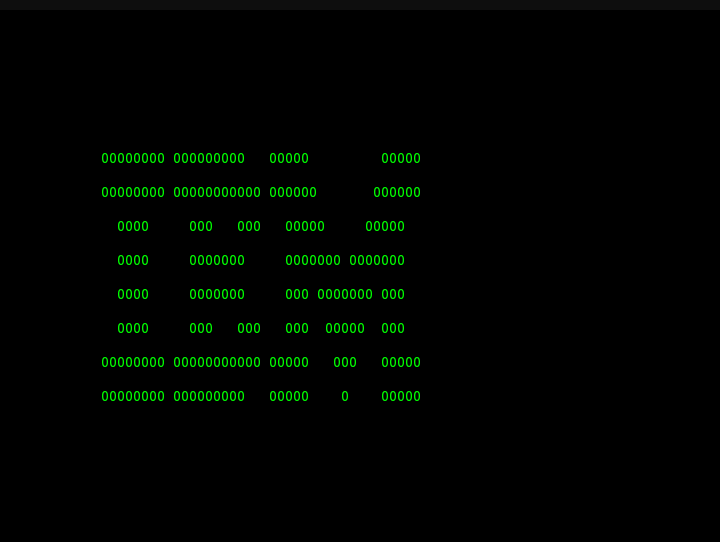
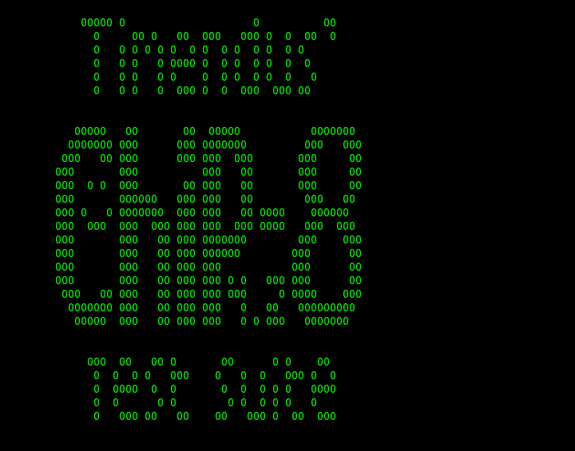

Un simple emulador de Chip-8 escrito en Rust y que se ejecuta en la terminal aun en desarrollo :).

Aquí una [Guía](https://foro.linuxchad.org/t/diario-de-desarrollo-creacion-de-un-emulador-de-chip-8/3378) de como van las cosas.

